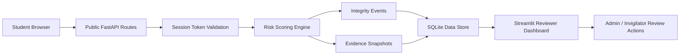
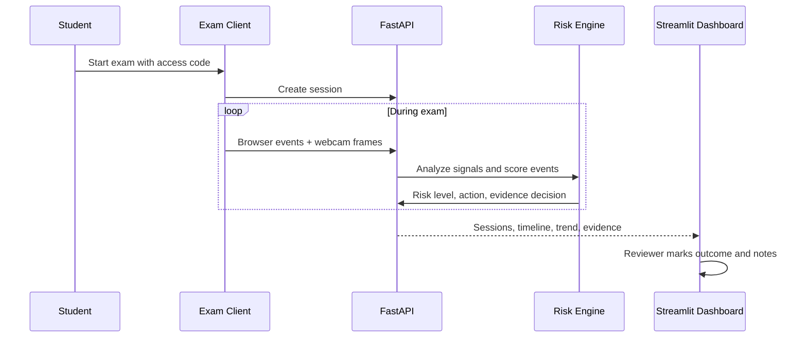
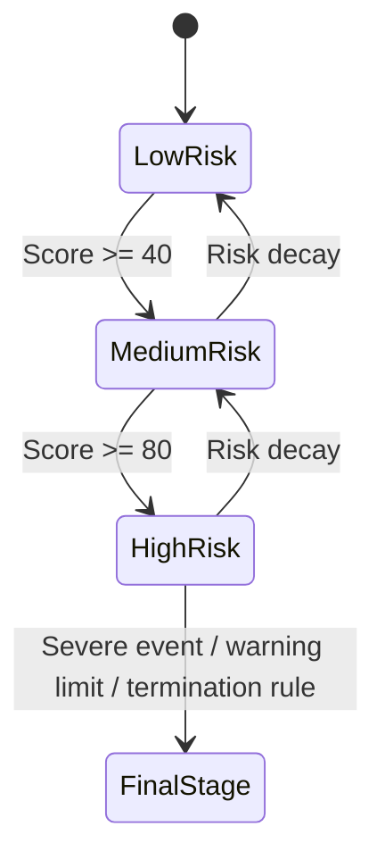

# ExamProcter

ExamProcter is an AI-powered remote exam integrity and risk scoring platform built as an interview-ready product demo.

[](https://github.com/yash752-stack/examprocter)

One-line pitch:

> An AI-powered system that detects and prevents cheating in online exams using behavior analysis, risk scoring, warning stages, evidence capture, and reviewer workflows.

## Demo status

- Public hosted demo: not currently available
- Local reviewer dashboard: available with the setup steps below
- Full student monitoring flow works best when the FastAPI backend is run locally or deployed separately and connected with `API_BASE_URL`

If you publish a public Streamlit or full-stack deployment later, add that URL here after verifying it is accessible without account restrictions.

Demo dashboard credentials:

- Admin: `admin@examprocter.dev` / `Admin@123`
- Invigilator: `invigilator@examprocter.dev` / `Invigilator@123`

## Why this project stands out

Most exam-proctoring demos stop at “we detected something suspicious.” ExamProcter is stronger because it behaves more like a product:

- It uses cumulative risk scoring instead of brittle binary flags.
- It escalates from soft warning -> strict warning -> flag or terminate.
- It stores evidence snapshots for reviewable violations.
- It supports role-aware reviewer workflows instead of raw event logs only.
- It includes analytics, filtering, and trend inspection for a more realistic admin experience.

## Full feature map

| Area | Features |
| --- | --- |
| Student exam flow | Exam selection, access-code entry, session creation, exam rules display, browser-based monitoring hooks |
| Browser integrity | Tab switch detection, window blur detection, fullscreen exit detection, copy/paste detection, context-menu detection |
| Vision signals | OpenCV face detection, attention-direction heuristics, no-face detection, suspicious motion checks, multi-face detection |
| Event taxonomy | `looking_left`, `looking_right`, `looking_down`, `looking_up`, `looking_away_long_duration`, `no_face_long_duration`, `multiple_faces`, `phone_detected`, `fullscreen_exit`, `face_identity_mismatch` |
| Risk engine | Weighted points per event, risk levels, warning stages, automatic session flagging, optional termination rules, risk decay after clean behavior |
| Evidence and review | Automatic evidence snapshots for reviewable events, event timeline, reviewer notes, reviewer attribution, manual outcome marking |
| Reviewer dashboard | Session table, filters by exam/risk/status/review state, high-risk queue, evidence gallery, risk trend chart, event breakdown chart |
| Admin tools | Role-aware login, exam creation, access-code management, rule configuration, demo data seeding |
| Deployment modes | Streamlit-only hosted demo mode, local full-stack mode with FastAPI + Streamlit, split deployment support via `API_BASE_URL` |

## Current product flow

### Student flow

- Student selects an exam
- Student enters the exam access code
- A monitored session starts
- Browser hooks and webcam analysis run during the session
- Risk score updates based on suspicious signals
- Warning stages escalate if violations accumulate

### Reviewer flow

- Admin or invigilator logs into the dashboard
- Sessions are filtered by exam, risk level, status, and review outcome
- Reviewer opens one session to inspect:
  - live summary
  - risk score and warning stage
  - suspicious activity timeline
  - evidence gallery
  - risk score over time
- Reviewer marks the session as:
  - `pending`
  - `confirmed_flag`
  - `false_positive`
  - `clean`

## Detection and scoring

### Browser events

- `tab_switch`
- `window_blur`
- `fullscreen_exit`
- `copy`
- `paste`
- `context_menu`

### Vision and monitoring events

- `looking_left`
- `looking_right`
- `looking_down`
- `looking_up`
- `looking_away_long_duration`
- `multiple_faces`
- `suspicious_motion`
- `no_face_detected`
- `no_face_long_duration`
- `phone_detected`
- `face_identity_mismatch`
- `webcam_offline`

### Risk model highlights

| Event | Base points | Notes |
| --- | --- | --- |
| `looking_left` / `looking_right` | 12 | Increased if attention score is very low |
| `looking_down` | 14 | Medium-risk attention signal |
| `looking_away_long_duration` | 24 | Increased further for longer streaks |
| `tab_switch` | 30 | Increased for longer hidden durations |
| `fullscreen_exit` | 30 | Increased for longer fullscreen exits |
| `multiple_faces` | 50 | Increased if more than two faces are visible |
| `no_face_long_duration` | 35 | High-risk absence signal |
| `phone_detected` | 70 | Immediate high-risk evidence signal |
| `face_identity_mismatch` | 65 | Reserved for stronger identity assurance logic |

### Alerting logic

- Low risk: monitoring continues quietly
- Medium risk: warning issued
- High risk: flag for review
- Final stage: flagged or terminated depending on exam policy
- Risk decay: score drops by `5` points every `5` clean minutes

## Dashboard graphs and evidence views

These are the main analytics surfaces already available in the project:

- Risk score over time line chart
- Detection event breakdown bar chart
- Session operations table with risk, warnings, evidence, and review states
- Reviewer queue for pending or severe sessions
- Suspicious activity timeline table
- Evidence gallery with captured snapshots

## Architecture graph



## Monitoring workflow graph



## Escalation graph



## Repository structure

```text
backend/app/
  auth.py
  database.py
  detectors.py
  evidence.py
  main.py
  models.py
  schemas.py
  scoring.py
  services.py
frontend/
  embedded_backend.py
  streamlit_dashboard.py
static/
  exam_client.html
tests/
streamlit_app.py
```

## Demo credentials and codes

Dashboard accounts:

- Admin
  - email: `admin@examprocter.dev`
  - password: `Admin@123`
- Invigilator
  - email: `invigilator@examprocter.dev`
  - password: `Invigilator@123`

Default exam access codes:

- `CAMPUS2026`
- `ANALYST2026`

## Local run

### Full stack

```bash
python3 -m venv .venv
source .venv/bin/activate
pip install -r requirements-backend.txt
uvicorn backend.app.main:app --reload
```

In a second terminal:

```bash
source .venv/bin/activate
API_BASE_URL=http://localhost:8000 streamlit run streamlit_app.py
```

Or:

```bash
chmod +x start.sh
./start.sh
```

### Streamlit-only hosted-style demo

```bash
python3 -m venv .venv-demo
source .venv-demo/bin/activate
pip install -r requirements.txt
streamlit run streamlit_app.py
```

URLs:

- Student exam client: `http://localhost:8000/exam`
- FastAPI docs: `http://localhost:8000/docs`
- Streamlit dashboard: `http://localhost:8501`

## API shape

Main routes live under `/api/v1`.

Examples:

- `POST /api/v1/auth/login`
- `GET /api/v1/auth/me`
- `GET /api/v1/public/exams`
- `POST /api/v1/public/sessions`
- `POST /api/v1/public/sessions/{id}/events`
- `POST /api/v1/public/sessions/{id}/frames`
- `POST /api/v1/public/sessions/{id}/end`
- `GET /api/v1/dashboard/overview`
- `GET /api/v1/dashboard/exams`
- `POST /api/v1/dashboard/exams`
- `GET /api/v1/dashboard/sessions`
- `GET /api/v1/dashboard/sessions/{id}/timeline`
- `GET /api/v1/dashboard/sessions/{id}/evidence`
- `GET /api/v1/dashboard/sessions/{id}/risk-trend`
- `PATCH /api/v1/dashboard/sessions/{id}/review`

## Interview-friendly metrics

- Detection accuracy
  - based on reviewer-confirmed outcomes
- False positive rate
  - based on reviewed flagged sessions
- Average risk score
- Flagged session percentage
- Evidence count per session
- Risk score over time
- Event type distribution
- Warning-stage distribution

## Honest tradeoffs

- Face attention is still heuristic, not full head-pose estimation
- Phone detection is a demo hook, not a YOLO pipeline yet
- SQLite is used for portability; PostgreSQL is the next backend upgrade
- Real-time dashboard updates are request-refresh based, not WebSockets yet
- Streamlit Community Cloud runs the reviewer console in embedded demo mode unless `API_BASE_URL` points at a deployed FastAPI backend

These tradeoffs are useful in interviews because they show product prioritization and roadmap thinking rather than pretending the system is production-perfect.

## Next roadmap

Phase 2 upgrades that fit naturally from here:

- JWT auth
- PostgreSQL + Redis
- WebSockets for live monitoring
- YOLO-based object detection
- Face verification
- Audio analysis
- Reviewer export reports
- Exportable reports
